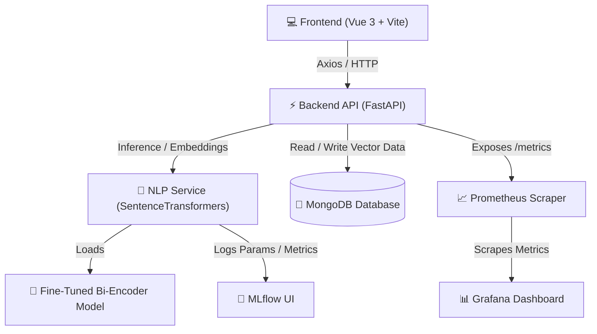

# 🎯 CV Matcher Pro: Intelligent Recruitment & Talent Analytics Platform

## 📖 Overview

**CV Matcher Pro** is an AI-powered recruitment and talent analytics platform designed to automate candidate screening, job matching, semantic job recommendation, and candidate clustering using Natural Language Processing (NLP) and Sentence Transformers. 

The system leverages a fine-tuned multilingual Bi-Encoder to support both **Job Seekers** and **Recruiters / HR Professionals** through highly accurate semantic search, explainable AI matching, and batch candidate segmentation.

---

## 🏗️ System Architecture

The following diagram illustrates how the system's components interact:



---

## 🚀 Key Features

### 🔍 Job Seeker Module

*   **CV ↔ Job Description Matching**: 
    Perform deep semantic comparison using a fine-tuned Bi-Encoder to generate a similarity score, analyze skill coverage, and produce human-readable reasoning.
    
    *Example Match Output:*
    ```json
    {
      "match_score": 87.5,
      "recommendation": "Strong Match",
      "matched_skills": ["Python", "Docker", "FastAPI"],
      "missing_skills": ["Kubernetes"]
    }
    ```

*   **Semantic Job Search**: 
    Upload a CV to retrieve the top-K matching job descriptions stored in MongoDB using dense vector similarity search.
    *   *Features*: Embedding-based retrieval, similarity-based ranking, and interactive list view.

*   **LinkedIn Job Scraping**: 
    Automatically scrape job posts from LinkedIn based on custom **Keywords**, **Location**, and **Time Range**, saving them alongside generated description embeddings.

---

### 👥 Recruiter / HR Module

*   **Candidate Ranking**: 
    Upload a folder of CV PDFs and rank them against a target job description. The final score is computed as:
    
    $$\text{Final Score} = (85\% \times \text{Semantic Similarity}) + (15\% \times \text{Skill Coverage})$$

*   **Candidate Clustering**: 
    Perform K-Means clustering on candidate CV embeddings to group similar talents together dynamically (e.g., separating backend, frontend, and QA candidates).
    *   *Benefits*: Automated talent segmentation, bulk campaign processing, and targeted candidate screening.

*   **Explainable AI (XAI)**: 
    Every match analysis is backed by an automated explanation that breaks down matched skills, missing competencies, and a reasoning summary:
    
    ```json
    {
      "reasoning": [
        "Candidate matches 8 required skills.",
        "Missing skills: Kubernetes, Terraform.",
        "Overall recommendation: Strong Match."
      ]
    }
    ```

---

## 📊 MLOps & Monitoring

### 🧪 Experiment Tracking (MLflow)
The model training pipelines log hyperparameters, datasets, and performance metrics to local MLflow servers.
*   **Tracked Items**: Dataset version, training epochs, batch size, Precision@K, Recall@K, MRR, and NDCG.
*   **Start Server**: `mlflow ui`
*   **Access Web UI**: [http://localhost:5000](http://localhost:5000)

### 📈 Metrics Scraper (Prometheus)
Real-time metrics are scraped from the FastAPI `/metrics` endpoint to log API behavior.
*   **Metrics Endpoint**: [http://localhost:8000/metrics](http://localhost:8000/metrics)

| Metric | Type | Description |
| :--- | :--- | :--- |
| `cv_matcher_requests_total` | Counter | Total API requests received (labeled by endpoint) |
| `cv_matcher_request_latency_seconds` | Histogram | Request latency distribution (labeled by endpoint) |
| `cv_matcher_analysis_total` | Counter | Total CV-JD match analysis requests |
| `semantic_search_total` | Counter | Total semantic job search requests |
| `hr_ranking_total` | Counter | Total HR ranking requests |
| `cv_clustering_total` | Counter | Total CV clustering requests |

### 📉 Visualization Dashboard (Grafana)
A pre-configured dashboard displays real-time API health, latency metrics, and throughput.
*   **Default Credentials**: Username: `admin` | Password: `admin`
*   **Access Web UI**: [http://localhost:3050](http://localhost:3050)

---

## 🧠 Model Development

*   **Base Model**: `paraphrase-multilingual-MiniLM-L12-v2` (from SentenceTransformers)
*   **Fine-Tuned Model**: Located locally in `models/bi-encoder-cv-matcher`
*   **Training Loss Function**: `MultipleNegativesRankingLoss`
*   **Dataset**: Synthetic Dataset v4 (generated from custom IT/HR templates)

### 📊 Evaluation Results

| Metric | Baseline Model | Fine-Tuned Model |
| :--- | :---: | :---: |
| **Precision@5** | 1.0000 | **1.0000** |
| **Recall@5** | 0.1968 | **0.1968** |
| **MRR** | 1.0000 | **1.0000** |
| **NDCG@5** | 1.0000 | **1.0000** |

---

## 🧪 Testing & CI/CD

### Running Tests Locally:
Inside the `backend/` directory, run:
```bash
python -m pytest test -v
```

### Running Test Coverage Analysis:
```bash
python -m pytest test --cov=app --cov-report=term
```

**Test Files Included:**
*   `test_parser.py`: Evaluates PDF/text extraction and pre-processing.
*   `test_explainability.py`: Validates recommendation logic thresholds.
*   `test_match_api.py`: Tests CV-JD detailed matching endpoint with mocks.
*   `test_semantic_search.py`: Validates vector search with MongoDB mocks.
*   `test_hr_rank.py`: Tests the HR bulk candidate ranking logic.
*   `test_hr_cluster.py`: Tests candidate K-Means document clustering.

### CI/CD Workflow
Implemented using GitHub Actions (`.github/workflows/backend.yml`), triggers automatically on `push` and `pull_request` to verify the codebase:
1.  Checkout repository
2.  Setup Python 3.10
3.  Install dependencies (`python -m pip install -r requirements.txt`)
4.  Run tests (`python -m pytest test -v`)
5.  Validate Docker Compose configurations

---

## 📁 Project Structure

```
.
├── .github/
│   └── workflows/
│       └── backend.yml        # CI pipeline config
├── backend/
│   ├── app/
│   │   ├── api/
│   │   │   ├── endpoints.py       # Core APIs (scrape, match, search)
│   │   │   ├── hr_endpoints.py    # HR APIs (rank, cluster)
│   │   │   └── jobs_endpoints.py  # Jobs operations
│   │   ├── core/
│   │   │   ├── domain_loader.py   # Dynamic domain config loader
│   │   │   ├── metrics.py         # Prometheus metrics counters
│   │   │   ├── mongodb.py         # MongoDB connection helper
│   │   │   └── skills/            # Domain-specific JSON configs
│   │   │       ├── it.json
│   │   │       ├── hr.json
│   │   │       ├── finance.json
│   │   │       ├── creative.json
│   │   │       ├── sales.json
│   │   │       ├── legal.json
│   │   │       ├── pr.json
│   │   │       ├── ga.json
│   │   │       ├── cs.json
│   │   │       ├── operational.json
│   │   │       └── general.json
│   │   ├── services/
│   │   │   ├── linkedin_scraper.py# BeautifulSoup job scraper
│   │   │   ├── nlp.py             # NLP match, search, clustering logic
│   │   │   └── parser.py          # PDF/DOCX parsing & cleaning logic
│   │   └── main.py                # FastAPI app entrypoint
│   ├── requirements.txt
│   └── Dockerfile
├── frontend/
│   ├── src/
│   │   ├── components/            # Reusable UI components
│   │   ├── views/                 # View pages (Analyze, Cluster, Scrape, etc.)
│   │   ├── router/                # Vue Router configuration
│   │   ├── App.vue                # Root App component
│   │   └── main.js                # App entrypoint
│   ├── Dockerfile
│   └── package.json
├── training/
│   ├── scripts/
│   │   ├── generate_dataset.py    # Synthetic data generator
│   │   └── train_bi_encoder.py    # Bi-Encoder training script
│   ├── templates/
│   │   ├── anchor_templates.json  # Job description templates
│   │   ├── positive_templates.json# Matching CV templates
│   │   └── negative_templates.json# Non-matching CV templates
│   └── notebooks/
│       └── finetuning-model.ipynb # Training orchestrator
├── data/
│   └── training/                  # Generated CSV datasets
├── models/                        # Fine-tuned model outputs
├── .env.example                   # Env template
└── docker-compose.yml             # Orchestration file
```

---

## ⚙️ Dataset & Customization

### Training Dataset

The project uses synthetic training data generated from domain-specific templates and skill configurations. Datasets are stored in `data/training/` as CSV files.

**File Structure:**
```
data/training/
├── bi_encoder_train.csv      # Triplet data (anchor, positive, negative)
└── README.md                 # Dataset format documentation
```

### Domain Configurations

Each domain has its own JSON configuration file in `backend/app/core/skills/`. These files define skills, roles, thresholds, and other domain-specific data.

**Available Domains:**
| File | Domain | Threshold (Direct) | Threshold (Master) |
| :--- | :--- | :---: | :---: |
| `it.json` | IT | 0.80 | 0.82 |
| `hr.json` | HR | 0.75 | 0.77 |
| `finance.json` | Finance | 0.75 | 0.77 |
| `creative.json` | Creative & Marketing | 0.70 | 0.72 |
| `sales.json` | Sales & Business Development | 0.70 | 0.72 |
| `legal.json` | Legal | 0.78 | 0.80 |
| `pr.json` | PR & Corcom | 0.72 | 0.74 |
| `ga.json` | GA | 0.70 | 0.72 |
| `cs.json` | CS & Aftersales | 0.70 | 0.72 |
| `operational.json` | Operational | 0.73 | 0.75 |
| `general.json` | General (Default) | 0.75 | 0.77 |

### Customizing Domain Skills

To add or modify skills for a specific domain, edit the corresponding JSON file in `backend/app/core/skills/`.

**Example: Adding a skill to `it.json`:**

```json
{
  "domain": "IT",
  "skills": [
    "Python", "JavaScript", "Docker", "Kubernetes",
    "Rust", "Go", "Terraform"
  ],
  "roles": [
    "Backend Engineer", "DevOps Engineer", "Site Reliability Engineer"
  ],
  "projects": [
    "REST API development", "CI/CD pipeline setup"
  ]
}
```

**Available Fields per Domain:**

| Field | Type | Description | Example |
| :--- | :--- | :--- | :--- |
| `skills` | `string[]` | Core competencies for the domain | `["Python", "Docker", "SQL"]` |
| `roles` | `string[]` | Job titles specific to the domain | `["Backend Engineer", "DevOps"]` |
| `teams` | `string[]` | Department/team names | `["Engineering", "Data Science"]` |
| `projects` | `string[]` | Domain-specific project types | `["API development", "migration"]` |
| `unrelated_industries` | `string[]` | Industries unrelated to domain | `["Farming", "Mining"]` |
| `unrelated_roles` | `string[]` | Roles from other domains | `["Graphic Designer", "Accountant"]` |
| `unrelated_tools` | `string[]` | Tools not used in this domain | `["Photoshop", "AutoCAD"]` |
| `experience_keywords` | `string[]` | Phrases indicating experience | `["years of experience"]` |
| `education_keywords` | `string[]` | Education-related terms | `["bachelor", "computer science"]` |
| `threshold_direct_match` | `float` | Similarity threshold for direct matching | `0.80` |
| `threshold_master_match` | `float` | Similarity threshold for master skill matching | `0.82` |

### Customizing Templates

Templates control how synthetic training data is generated. They are located in `training/templates/`.

**Template Files:**
| File | Purpose | Example |
| :--- | :--- | :--- |
| `anchor_templates.json` | Job description templates | `"Dibutuhkan {role} yang menguasai {skill}"` |
| `positive_templates.json` | Matching CV templates | `"Pengalaman {years} tahun menggunakan {skill}"` |
| `negative_templates.json` | Non-matching CV templates | `"Keahlian {skill_unrelated} untuk {role_unrelated}"` |

**Available Placeholders:**

| Placeholder | Source | Description |
| :--- | :--- | :--- |
| `{skill}` | Domain `skills` array | Random skill from current domain |
| `{skill1}`, `{skill2}` | Domain `skills` array | Multiple skills |
| `{role}` | Domain `roles` array | Random role from current domain |
| `{years}` | Global | Random experience years |
| `{company}` | Global | Random company name |
| `{project}` | Domain `projects` array | Domain-specific project |
| `{skill_unrelated}` | Other domain's `skills` | Skill from different domain |
| `{role_unrelated}` | Domain `unrelated_roles` | Unrelated role |
| `{industry_unrelated}` | Domain `unrelated_industries` | Unrelated industry |
| `{tool_unrelated}` | Domain `unrelated_tools` | Unrelated tool |

**Example: Adding a template to `it.json`:**

```json
{
  "it": [
    "Dibutuhkan {role} yang menguasai {skill}",
    "We are looking for a {role} skilled in {skill}",
    "Minimal {years} tahun pengalaman di {skill} dan {skill2}",
    "Hiring {role} for {team} team - expert in {skill}"
  ]
}
```

### Generating Datasets

After customizing domains and templates, regenerate the training dataset:

```bash
# Generate 2000 triplets and 2000 pairs
python training/scripts/generate_dataset.py \
  --num_triplets 2000 \
  --num_pairs 2000
```

Or use the Jupyter notebook:
```bash
jupyter notebook training/notebooks/finetuning-model.ipynb
```

---

## 🛠️ Technology Stack

*   **Frontend**: Vue 3, Vite, Axios, TailwindCSS / Vanilla CSS
*   **Backend**: FastAPI, Sentence Transformers, PyTorch, Scikit-Learn, PyPDF, Python-docx
*   **Database**: MongoDB, Mongo Express
*   **Monitoring**: Prometheus, Grafana
*   **MLops**: MLflow
*   **DevOps**: Docker, Docker Compose, GitHub Actions (CI)
*   **Testing**: Pytest, Pytest-Cov, Pytest-Asyncio, HTTPX

---

## 🐳 Docker Deployment

To build and run all services (Frontend, Backend, Database, Prometheus, and Grafana) locally:

1.  **Configure environment variables**:
    ```bash
    cp .env.example .env
    ```
2.  **Build all images**:
    ```bash
    docker compose up --build
    ```
3.  **Run in the background (detached mode)**:
    ```bash
    docker compose up -d
    ```
4.  **Stop all containers**:
    ```bash
    docker compose down
    ```

### 🌐 Service Ports Summary

Once deployed, the following services are available:

| Service | Port / URL | Default Credentials |
| :--- | :--- | :--- |
| **Frontend Web App** | [http://localhost:5173](http://localhost:5173) | *None* |
| **FastAPI Swagger Docs** | [http://localhost:8000/docs](http://localhost:8000/docs) | *None* |
| **Mongo Express Web UI** | [http://localhost:8081](http://localhost:8081) | Username: `admin` \| Password: `password` |
| **Prometheus Dashboard** | [http://localhost:9090](http://localhost:9090) | *None* |
| **Grafana Dashboard** | [http://localhost:3050](http://localhost:3050) | Username: `admin` \| Password: `admin` |
| **MLflow Server (Local)** | [http://localhost:5000](http://localhost:5000) | *None* |

---

## 🔗 Available API Endpoints

### 🔍 Job Seeker Endpoints
*   `POST /api/scrape-recommend`: Scrapes jobs from LinkedIn and triggers immediate recommendation.
*   `POST /api/match-detailed`: Semantic CV ↔ JD matching with full explainability.
*   `POST /api/jobs/semantic-search`: Semantic vector search against MongoDB job collection.

### 👥 Recruiter / HR Endpoints
*   `POST /api/hr/rank`: Compares and ranks multiple CVs against a job description.
*   `POST /api/hr/cluster`: Groups multiple CVs into distinct talent categories.

### 💾 Database Utilities
*   `GET /api/jobs`: Fetches all jobs stored in the database.
*   `DELETE /api/jobs/clear`: Drops the scraped jobs collection.

### 📈 Health & Monitoring
*   `GET /`: Base API health check.
*   `GET /metrics`: Prometheus ASGI metrics exporter.

---

## 👥 Authors

**Capstone Project Team — Intelligent Recruitment & Talent Analytics Platform**
*   Built with FastAPI, Vue 3, PyTorch, MongoDB, MLflow, Prometheus, and Grafana.
